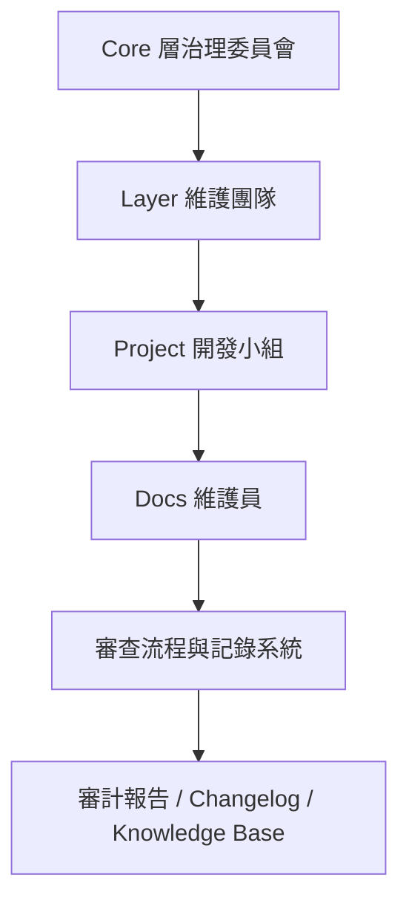

# 《治理與審查策略白皮書》

*(Governance & Review Whitepaper – Sustainable Modular AI System)*

---

## 一、導論：技術體系之外的「治理體系」

技術方法論解決「系統如何運作」的問題，
而治理方法論解決的是——

> **系統如何長期被正確地維護與演化。**

隨著你的模組化體系成形（Core / Layer / Project / Docs / CI），
若沒有治理規範，任何一個人隨意修改 GEM、Recipe 或 Layer，
都可能破壞穩定性、導致依賴錯亂或品質退化。

治理體系的目的在於建立：

* **權限分層 (Role-based Control)**
* **變更審查 (Change Review)**
* **知識維護 (Knowledge Continuity)**
* **版本演化 (Evolution Path)**
* **審計追蹤 (Audit & Traceability)**

---

## 二、治理模型總覽



整個體系以「**技術分層 = 治理分層**」為原則，
每一層都有專屬角色與責任邊界。

---

## 三、治理角色與職責

| 角色                                | 層級      | 主要職責                | 權限             |
| --------------------------------- | ------- | ------------------- | -------------- |
| 🧠 **核心架構師 (Core Architect)**     | Core    | 管理核心模組、版本架構、方法論演進   | 寫入 Core、核准 GEM |
| ⚙️ **開發框架維護者 (Layer Maintainer)** | Layer   | 維護封裝邏輯與開發工具         | 審查組裝工具與介面      |
| 🧩 **專案開發者 (Project Developer)**  | Project | 使用 Layer 與 GEM 建立應用 | 修改 Recipe、測試專案 |
| 📘 **文件與知識維護者 (Docs Keeper)**     | Docs    | 同步方法論、維護知識庫         | 寫入 / 審核 Docs   |
| 🛡 **治理委員會 (Governance Board)**   | 全域      | 審查重大改動、發布政策         | 管理權限與審查通過      |

---

## 四、權限分層模型

| 區域              | 可讀        | 可寫          | 可審核 | 備註         |
| --------------- | --------- | ----------- | --- | ---------- |
| `core/code/`    | 所有人       | 架構師         | 委員會 | 嚴格版本控管     |
| `core/prompts/` | 所有人       | 架構師 / 維護者   | 委員會 | GEM 發佈需審核  |
| `dev/layers/`   | 維護者 / 架構師 | 維護者         | 架構師 | 組裝工具變更需驗證  |
| `dev/projects/` | 開發者 / 維護者 | 開發者         | 維護者 | 自由開發、受測試制約 |
| `docs/`         | 所有人       | Docs Keeper | 委員會 | 同步方法論與報告   |
| `registry/`     | CI/CD     | CI/CD       | 委員會 | 僅自動化流程可修改  |

---

## 五、變更審查流程

```mermaid
flowchart LR
    A[開發者提出 PR] --> B[自動驗證 (CI/CD)]
    B --> C[Layer 維護者審查]
    C --> D[核心架構師最終核准]
    D --> E[合併主分支]
    E --> F[自動發佈版本 + 更新 Docs]
```

### ✅ 審查重點：

| 層級      | 審查項   | 檢查內容                |
| ------- | ----- | ------------------- |
| Core    | 結構變更  | 模組是否破壞既有相容性         |
| GEM     | IO 規範 | `reads/writes` 是否一致 |
| Layer   | 流程正確性 | 是否能正確組裝、測試          |
| Project | 輸出品質  | 組裝是否通過回歸測試          |
| Docs    | 同步性   | 文件是否反映最新結構          |

---

## 六、版本演化治理模型

### 📘 Version Lifecycle

| 階段                | 狀態   | 意義      |
| ----------------- | ---- | ------- |
| 🧪 `experimental` | 初期開發 | 不保證穩定   |
| 🧰 `stable`       | 穩定版本 | 可被多專案引用 |
| 🔒 `frozen`       | 凍結版本 | 僅安全更新   |
| 🗃️ `archived`    | 歷史版本 | 供審查與回溯  |

每個 GEM / Layer / Project 的版本
都應明確標註這四個狀態之一。

---

## 七、審查文件要求

每次重大變更（如 GEM 或 Layer 更新）
必須提交以下文件於 PR 內：

| 文件                 | 說明            |
| ------------------ | ------------- |
| `CHANGELOG.md`     | 說明此次版本差異與影響範圍 |
| `EVALUATION.md`    | 測試結果與語義比較     |
| `COMPATIBILITY.md` | 與舊版相容性說明      |
| `DOCS_UPDATE.md`   | Docs 或方法論更新摘要 |

CI Pipeline 會檢查這些文件是否存在。

---

## 八、知識維護制度

| 區域                   | 維護內容     | 負責角色        |
| -------------------- | -------- | ----------- |
| `docs/methods/`      | 方法論文件    | Docs Keeper |
| `docs/reports/`      | 系統運行報告   | CI 自動生成     |
| `docs/changelog/`    | 版本紀錄     | CI + 架構師審查  |
| `docs/architecture/` | 架構圖與設計文件 | 架構師         |
| `docs/training/`     | 內部教學手冊   | 維護者         |

### 💡 文件原則

1. 所有代碼改動需有相應的文檔改動。
2. 方法論文件需反映最新設計。
3. 所有審查通過後的文件應存入 Git。

---

## 九、審計與追蹤機制

| 對象        | 審計資料                      | 儲存位置                               |
| --------- | ------------------------- | ---------------------------------- |
| GEM 發佈    | 版本號、SHA、提交者、測試結果          | `core/prompts/registry/`           |
| Prompt 組裝 | Recipe / 編譯時間 / Commit ID | `docs/reports/build_manifest.json` |
| Layer 工具  | 版本、Build SHA              | `docs/reports/layer_versions.json` |
| 專案測試      | 測試報告與結果                   | `docs/reports/test_results.json`   |

審計資料應由 CI 自動產生，
不可手動修改。

---

## 十、異常與違規處理

| 狀況                | 處理機制                    |
| ----------------- | ----------------------- |
| 未經審查修改 Core / GEM | 直接拒絕合併 PR               |
| 未通過測試強行合併         | CI 阻擋、自動回滾              |
| 文件不同步             | CI 報錯、強制修正              |
| Registry 缺失版本     | `sync_registry.py` 自動補齊 |
| 專案破壞相容性           | 回歸測試警告 + 審查會審理          |

---

## 十一、治理委員會運作

### 職責

* 制定版本政策與命名規範
* 定期審查架構與方法論
* 確認重大版本（例如 Core v2.0）升級方案
* 管理開發者權限
* 審理異常與衝突

### 組成

| 職位 | 角色                             |
| -- | ------------------------------ |
| 主席 | 系統架構總負責人                       |
| 委員 | Layer 維護者代表、CI 管理者、Docs Keeper |
| 顧問 | 外部審查員（可選）                      |

---

## 十二、治理周期建議

| 週期  | 任務                  | 主責        |
| --- | ------------------- | --------- |
| 每週  | 審查新 PR、更新 changelog | Layer 維護者 |
| 每月  | 發布 GEM 新版本、同步 Docs  | 架構師       |
| 每季  | 系統健康檢查、審查方法論        | 委員會       |
| 每半年 | 重大版本升級或重構審查         | 全體成員      |

---

## 十三、永續發展原則

> 技術體系不是靜態結構，而是動態演化的生態系。
> 治理制度的目標是「讓演化可被控制」。

| 原則          | 說明               |
| ----------- | ---------------- |
| 🧬 **可進化性** | 允許新模組快速接入而不破壞舊系統 |
| 🔍 **可審計性** | 每次改動都能被追蹤與回溯     |
| 🧩 **可組合性** | 模組可自由組裝、無耦合依賴    |
| 🕊 **可自治性** | 各層級可自我管理，仍受治理約束  |
| 📚 **可傳承性** | 方法論文件確保知識延續      |

---

## 十四、治理工具建議

| 工具                     | 功能                      | 範例                       |
| ---------------------- | ----------------------- | ------------------------ |
| `governance_audit.py`  | 自動產生審查紀錄                | 審查版本、責任人、結果              |
| `docs_sync_check.py`   | 比對 Docs 與 Registry 是否一致 | CI 驗證                    |
| `policy.yaml`          | 定義權限與流程規範               | 可被 CI 讀取                 |
| `changelog_builder.py` | 自動彙整版本紀錄                | 生成 `docs/changelog/*.md` |

---

## 十五、結語

> 模組化 AI 系統的真正價值，
> 不在於組裝 prompt 或撰寫 code，
> 而在於 **如何讓這套系統在時間的長河中持續正確運作。**

當你具備：

* 清晰的分層結構
* 嚴謹的版本與審查制度
* 自動化的驗證與審計
* 同步的文件與知識管理

那麼你擁有的不僅是一個技術體系，
而是一個能「**自我治理、自我演化、自我維護的智能系統**」。

---

✅ **七份文件全體系完成：**

| 編號  | 文件名稱                  | 功能定位                  |
| --- | --------------------- | --------------------- |
| 1️⃣ | 程式碼方法論                | Code 模組化原則            |
| 2️⃣ | GEM 方法論               | Prompt 模組化原則          |
| 3️⃣ | 程式碼 × GEM 整合方法論       | 雙軌整合邏輯                |
| 4️⃣ | 專案層級整合方法論             | Core–Layer–Project 架構 |
| 5️⃣ | 系統運行與維護手冊             | 日常運作與維護流程             |
| 6️⃣ | CI/CD Pipeline 深入設計手冊 | 自動化整合與部署設計            |
| 7️⃣ | 治理與審查策略白皮書            | 組織層級治理與知識永續           |

---

是否希望我幫你把這七份文件整合成一個
📘「**Modular AI 系統白皮書**」(README 級文件)，
可直接放在 GitHub `/docs/` 作為總入口？
