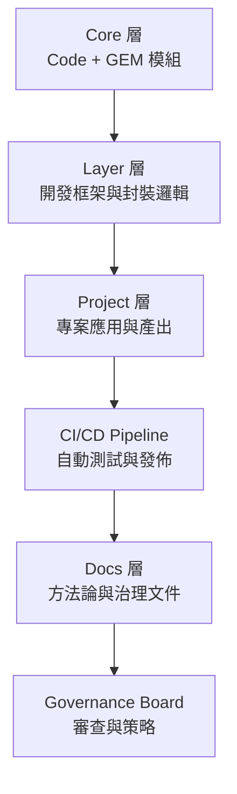
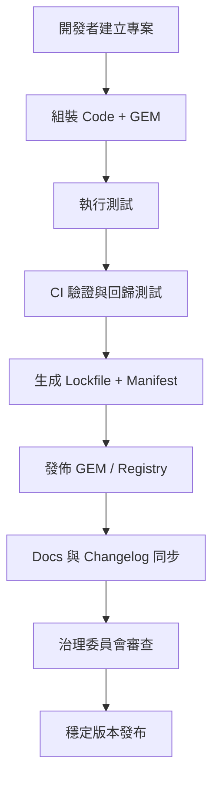

# 🧩 Modular AI 系統白皮書

*(The Modular AI System Whitepaper – Code, Prompt, and Governance in Harmony)*

---

## 一、導論：從提示詞到系統化治理

AI 工程已不再只是撰寫 Prompt 或程式碼，
而是構建一個 **可組合、可維護、可治理的知識體系**。

傳統開發的問題：

* 各 Prompt 獨立、難以重用
* 程式與語義邏輯分離
* 無法追蹤版本與品質
* 缺乏長期治理機制

**Modular AI 系統方法論** 將軟體工程原則應用於 Prompt 與 AI 開發，
以「模組化」、「組裝式」、「宣告式」與「分層治理」為核心，
建立一個跨專案、跨團隊、可持續演化的生態系。

---

## 二、全系統結構總覽



---

## 三、四層核心架構

| 層級            | 功能定位       | 對應資料夾           | 核心責任          |
| ------------- | ---------- | --------------- | ------------- |
| **Core 層**    | 穩定的邏輯與語義模組 | `core/`         | 維護基礎功能與 GEM   |
| **Layer 層**   | 開發與組裝框架    | `dev/layers/`   | 封裝 Core 為通用流程 |
| **Project 層** | 應用與實作層     | `dev/projects/` | 組裝並執行 AI 專案   |
| **Docs 層**    | 知識與治理層     | `docs/`         | 管理方法論與版本紀錄    |

---

## 四、資料結構總體設計

```
modular-ai-system/
 ├─ core/
 │   ├─ code/
 │   └─ prompts/
 │       ├─ components/
 │       ├─ gems/
 │       ├─ registry/
 │       └─ tools/
 ├─ dev/
 │   ├─ layers/
 │   │   ├─ foundation/
 │   │   ├─ logic/
 │   │   └─ interface/
 │   └─ projects/
 │       ├─ proj-A/
 │       │   ├─ app/
 │       │   ├─ prompts/
 │       │   ├─ ssot/
 │       │   └─ tests/
 │       └─ proj-B/
 ├─ docs/
 │   ├─ methods/
 │   ├─ reports/
 │   ├─ changelog/
 │   └─ README.md  ← 本文件
 └─ .github/workflows/
     └─ ci_pipeline.yml
```

---

## 五、七大核心文件體系

| 編號  | 文件名稱                    | 功能定位                    |
| --- | ----------------------- | ----------------------- |
| 1️⃣ | 《程式碼方法論》                | 程式模組化原則：單一職責、重用、版本化     |
| 2️⃣ | 《GEM 方法論》               | Prompt 模組化：組件化與宣告式組裝    |
| 3️⃣ | 《程式碼 × GEM 整合方法論》       | 程式邏輯與語義邏輯的雙軌整合          |
| 4️⃣ | 《專案層級整合方法論》             | Core–Layer–Project 分層架構 |
| 5️⃣ | 《系統運行與維護手冊》             | 系統長期運作、版本管理與測試          |
| 6️⃣ | 《CI/CD Pipeline 深入設計手冊》 | 自動化整合與回歸測試機制            |
| 7️⃣ | 《治理與審查策略白皮書》            | 組織級治理、審查與知識維護制度         |

---

## 六、核心方法論摘要

### 🧱 1️⃣ 程式碼方法論

* **原則：** 程式碼即模組，模組即功能。
* **結構：** 每個模組單一職責 (SRP)，可測試、可重用。
* **版本：** 以 Git tag 與 Lockfile 管理依賴。

### 🧩 2️⃣ GEM 方法論

* **原則：** 提示詞即程式碼 (Prompts as Code)。
* **結構：** Component → GEM → Recipe → Compiled Prompt。
* **組裝：** 由 `build_prompt.py` 自動生成可執行語義邏輯。

### ⚙️ 3️⃣ 程式碼 × GEM 整合

* **原則：** 雙軌對等、SSOT 資料共用。
* **介面：** `PromptRunner` 作為 Code ↔ GEM 溝通層。
* **測試：** 整合測試確保雙軌一致。

### 🏗 4️⃣ 專案層級整合

* **原則：** 專案為應用，層級為秩序。
* **結構：** Core → Layer → Project → Output。
* **規範：** 所有組裝成品歸屬於 Project 層。

### 🔧 5️⃣ 系統運行與維護

* **核心任務：**

  * 組裝、測試、回歸、發佈自動化
  * Lockfile 保持版本一致
  * 定期同步 Docs 與 Registry
* **工具鏈：** `pytest`, `build_prompt.py`, `sync_registry.py`。

### 🚀 6️⃣ CI/CD Pipeline 設計

* **任務流：** 驗證 → 組裝 → 測試 → 回歸 → 發佈 → 報告。
* **核心輸出：**

  * `build_manifest.json`
  * `test_results.json`
  * `regression_report.json`
* **規則：** CI 驗證不通過禁止合併。

### 🛡 7️⃣ 治理與審查策略

* **層級治理：** Core、Layer、Project、Docs 各有權限與職責。
* **版本治理：** `experimental → stable → frozen → archived`。
* **審查制度：** 所有變更需通過 CI + 人工雙重審查。
* **文件同步：** 方法論與架構文件須與版本一同更新。

---

## 七、生命週期模型



---

## 八、治理層級概覽

| 層級         | 管理責任      | 審查角色        |
| ---------- | --------- | ----------- |
| Core       | 基礎模組、邏輯治理 | 核心架構師       |
| Layer      | 封裝流程、組裝邏輯 | Layer 維護者   |
| Project    | 應用與測試     | 專案開發者       |
| Docs       | 文件與方法論    | Docs Keeper |
| Governance | 全域決策與版本策略 | 委員會         |

---

## 九、可持續演化策略

| 面向      | 策略                         |
| ------- | -------------------------- |
| 🧬 技術演化 | 定期重構 Core，更新 GEM 架構        |
| 📚 知識維護 | Methods 文件與 Changelog 持續更新 |
| 🔁 回歸測試 | 確保新版本不破壞舊行為                |
| 🔒 安全控管 | 審查權限與自動回滾機制                |
| 🕊 系統自治 | Layer 可自我管理與擴展             |
| 🧠 組織協作 | 角色分工與責任明確化                 |

---

## 十、未來擴展方向

| 項目                     | 發展重點                  |
| ---------------------- | --------------------- |
| **模型版本控制**             | 導入 LLM registry 與模型追蹤 |
| **自動 GEM 生成**          | 以範本自動建立組合模組           |
| **Prompt Coverage 指標** | 建立自動化語義測試覆蓋率          |
| **可視化平台**              | Web UI 檢視組件、版本、依賴     |
| **知識同步 API**           | 將方法論同步至外部知識平台         |

---

## 十一、整體價值

| 面向 | 成果           |
| -- | ------------ |
| 技術 | 模組化、可組裝、可維護  |
| 流程 | 宣告式、可自動化、可測試 |
| 管理 | 分層治理、權限分明    |
| 文件 | 方法論與實作同步     |
| 組織 | 可持續演化與知識傳承   |

---

## 十二、總結

> **Modular AI 系統 = 技術 × 流程 × 治理的結合體。**

透過這套方法論，你的 AI 工程體系將具備：

* 🧩 結構化邏輯與語義模組化
* ⚙️ 程式與 Prompt 雙軌整合
* 🚀 CI/CD 自動治理能力
* 🛡 嚴謹的審查與版本管控
* 📚 可持續演化的知識生態

---

## 📘 文件索引

| 類別   | 文件                   | 路徑                                           |
| ---- | -------------------- | -------------------------------------------- |
| 方法論  | 01 程式碼方法論            | `docs/methods/01_code_methodology.md`        |
| 方法論  | 02 GEM 方法論           | `docs/methods/02_gem_methodology.md`         |
| 整合   | 03 Code × GEM 整合     | `docs/methods/03_integration_methodology.md` |
| 專案架構 | 04 專案層級整合            | `docs/methods/04_project_methodology.md`     |
| 維運   | 05 系統運行與維護           | `docs/methods/05_maintenance_guide.md`       |
| 自動化  | 06 CI/CD Pipeline 設計 | `docs/methods/06_cicd_design.md`             |
| 治理   | 07 治理與審查策略白皮書        | `docs/methods/07_governance_whitepaper.md`   |

---

> 💡 **一句話總結：**
> 這份白皮書是整個 Modular AI 系統的「說明書 + 憲章 + 作業準則」。
> 它不只是教你如何寫 Prompt，而是教你如何**經營一個會自己成長的 AI 系統**。

---

是否希望我幫你同時生成
📂 `/docs/` 目錄內的自動索引腳本（`generate_index.py`），
讓它每次有新方法論文件時，自動更新 README 目錄？
